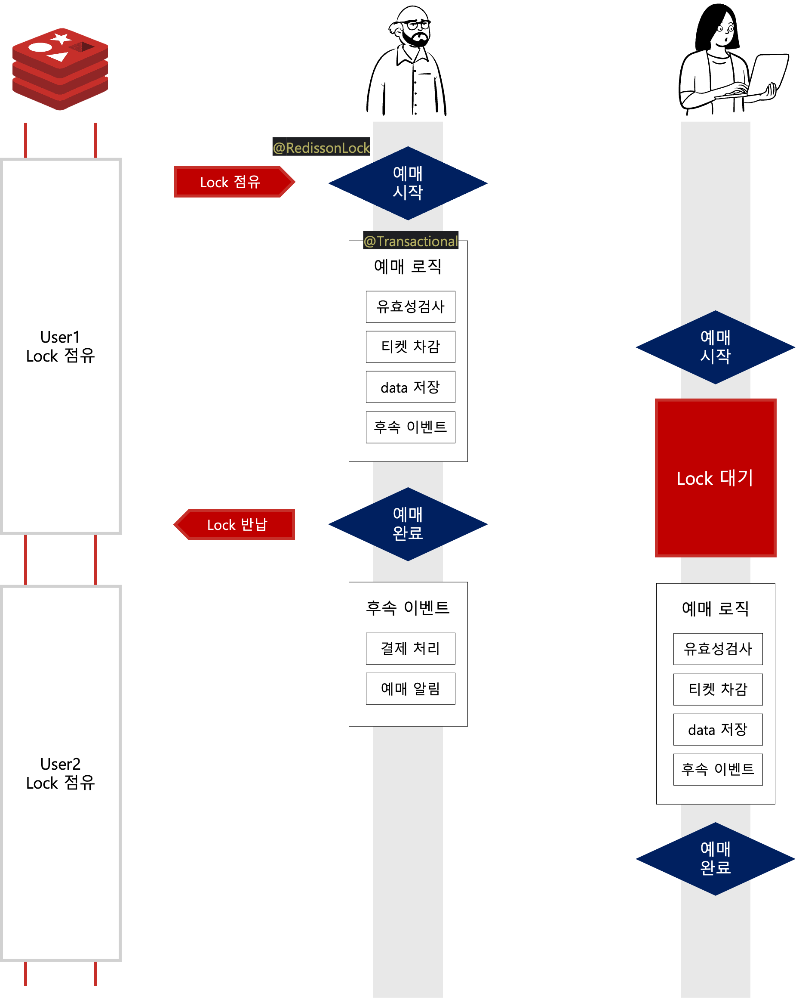

# 티켓팅 테스트

## 1. 기능 목표
- [x] 이벤트 예약
- [x] 이벤트 예약 검증 (블랙리스트, 화이트리스트, 예약 기간 등)

## 2. 기술 목표
- [x] redis 분산락
- [x] redis 캐시
- [x] 비동기 이벤트 - spring event publish / kafka event publish (후속 이벤트)

## 3. 주요 내용

